# Parity Technologies — Deep Analysis of Recent Releases & the Payment / Credits System

> An independent, source-checked walkthrough of the **[paritytech](https://github.com/paritytech)** GitHub organization, its newest apps, and — in detail — the one product that **pays and accepts payments**.
> **Analysis date:** 9 June 2026
> **Style:** professional technical analysis **+ ELI5** ("explain it like I'm 5") boxes.
> **Evidence:** every UI screenshot in this document is a **real image taken directly from the Parity repositories** (`paritytech/polkadot-hub-app/docs/images`), downloaded and visually inspected, not a mock-up.
>
> ⚠️ **Dating note (added after review):** this `polkadot-hub-app` is an **older (≈2023)** internal app — its screenshots reference 2023 events. For the **super-recent (2026)** repos and an honest answer on where payments now live, see the companion file **`Parity-Super-Recent-2026-EN.md`**. The payment/credits/membership UI below is still the clearest real example in the org, but it is **not** part of the new 2026 "Host + products" platform.

---

## Table of contents

1. [Executive summary](#1-executive-summary)
2. [The paritytech organization at a glance](#2-the-paritytech-organization-at-a-glance)
3. [Recent releases & new apps (with ELI5)](#3-recent-releases--new-apps-with-eli5)
4. [Deep dive: the Polkadot Hub App — guided screenshot tour](#4-deep-dive-the-polkadot-hub-app--guided-screenshot-tour)
5. [The payment & credits system — answering the four questions](#5-the-payment--credits-system--answering-the-four-questions)
6. [The other payment track: consumer Polkadot App + Raise](#6-the-other-payment-track-consumer-polkadot-app--raise)
7. [Confirmed vs. not-yet-public (transparency note)](#7-confirmed-vs-not-yet-public-transparency-note)
8. [Sources](#8-sources)

---

## 1. Executive summary

**Parity Technologies** builds the core infrastructure of **Polkadot** — a "blockchain of blockchains". It does not ship a single product; it ships the **toolbox** (SDK, virtual machine, compilers, networking) that others build on.

Among the recently active repositories, two threads matter for this analysis:

- A **new consumer-facing "Polkadot App"** (mobile + desktop), visible through its multi-platform **design-system** repos.
- A **self-hosted "Polkadot Hub App"** — internally branded **"Parity HQ"** — which is the concrete application that **pays and accepts payments** using **DOT** plus **membership / time-voucher NFTs**. This is the only app in the org whose **actual screenshots live in the repo**, so it is the centerpiece of this report.

**The short answer to your payment questions** (full detail in §5):

| Question | Answer (evidence-based) |
|---|---|
| **What "credits"?** | **DOT** = the payment currency. A free **soulbound membership NFT** = your identity/access pass. **Time-voucher NFTs** (day / month / year) = the spendable "credit" that grants access time. |
| **How is privacy preserved?** | **Non-custodial wallets** (Talisman, PolkadotJS, SubWallet, WalletConnect); **Login with Polkadot** (self-sovereign); the membership is a **non-transferable soulbound** token; a **"stealth mode"** toggle hides you from the office map; the whole app is **self-hosted** (each org runs its own instance = data sovereignty). |
| **How is the customer's account funded?** | The customer connects their **own external wallet** and pays in **DOT**. The fiat price (EUR/USD) is **recalculated to DOT at the moment of sale**; a time-voucher NFT is then minted to their wallet. |
| **How is the seller's account funded/settled?** | The hub's **smart contract / treasury** receives the **DOT** payment, then **mints the voucher token from the specified contract**; the soulbound membership is minted **from an existing collection**. |

---

## 2. The paritytech organization at a glance

> **ELI5:** Think LEGO. Parity doesn't sell the finished castle — it sells the bricks, the instructions and the tools so anyone can build their own. Polkadot is the big city where all those castles talk to each other.

Most active source repositories (as of 9 June 2026):

| Repository | What it is | ELI5 |
|---|---|---|
| **polkadot-sdk** | The official kit to build blockchains (Substrate, Cumulus, FRAME) | The big box of LEGO with every brick |
| **polkavm** | A fast, secure RISC-V virtual machine | The "engine" that runs programs on-chain |
| **revive** | Compiler that brings **Solidity** (Ethereum) contracts to PolkaVM | A translator: take an Ethereum program, run it on Polkadot |
| **smoldot** | A "light" client for Substrate chains | A tiny app that talks to the chain without downloading all of it |
| **substrate-connect** | A light client that runs **inside the browser** (WebAssembly) | Connect to the chain from a web page, install nothing |
| **litep2p** | Peer-to-peer networking library | The "intercom" the network's computers use to call each other |
| **foundry-polkadot** | Fast, portable developer toolkit | The developer's workbench |
| **substrate-api-sidecar** | REST service to talk to nodes | An "interpreter" turning app questions into chain questions |
| **polkadot-hub-app** ⭐ | Self-hosted app for offices, desks, rooms, events, profiles **+ DOT payments & membership NFTs** | The internal "Parity HQ" app — and the one that handles money |
| **polkadot-app-design-system** (+ android/ios/desktop) | Design tokens for the new consumer Polkadot App | The "official wardrobe" of the consumer app |
| **browse** | "Home for privacy apps" (experimental) | An "App Store" for privacy apps, listed on-chain |
| **gift-app** / **claim-nft** | Send crypto / claim NFTs to people with no account yet | Digital gift cards for onboarding |

---

## 3. Recent releases & new apps (with ELI5)

### 3.1 The new consumer "Polkadot App" (design-system family)

Repos: `polkadot-app-design-system` (JS core), `-android` (Kotlin), `-ios` (Swift/SwiftUI), `-desktop` (TypeScript/Tailwind). Built on **Style Dictionary v5**, which generates platform-specific code (colors, typography, spacing, radii, borders) **from a single source of truth**.

> **ELI5:** One wardrobe for the whole app. Decide the button color once, and it shows up identical on iPhone, Android and desktop. The existence of a full multi-platform design system is the tell-tale sign that Parity is pushing a real **mass-market app**, not a tool for geeks.

⚠️ These repos contain **design tokens only — no app screenshots**. The actual consumer-app UI is not published in the repos; what we can *show* lives in the Hub App (below).

### 3.2 The Polkadot Hub App — "Parity HQ" ⭐ (the app that handles money)

`polkadot-hub-app` (TypeScript, React + Node.js + Postgres, Apache-2.0). A **self-hosted** application for **hybrid teams across many continents**: office locations, desk booking, meeting rooms, events, guest invites, member profiles, onboarding, news — **plus** an optional **crypto layer**: connect a wallet, **pay in DOT**, hold **membership and time-voucher NFTs**.

> **ELI5:** It's the office app for a company spread around the world — book a desk, a meeting room, see who's in. But it also has a "crypto cash register": you can buy your membership and your days in the space by paying in DOT, and your pass is an NFT in your own wallet.

This is the only app whose **screenshots are physically in the repo** — see the full tour in §4.

### 3.3 `browse` — "Home for privacy apps"

A proof-of-concept platform (TypeScript, GPL-3.0) to **discover privacy apps, save favorites and share recommendations**, made of a client SPA + embeddable widget, **publishing-registry smart contracts**, and a Node.js SDK. Deployed on **Paseo** (Polkadot's test network) at `browse-beta00.paseo.li`.

> **ELI5:** Like an App Store, but for privacy-respecting apps, and the list of apps is written on the blockchain so nobody can quietly cheat or delete entries.

⚠️ The repo explicitly warns it is **experimental and unaudited**.

### 3.4 `gift-app` & `claim-nft` — onboarding by "voucher"

`gift-app` (default branch `polkadot`) lets a sender **wrap DOT/KSM as a gift** using a **secret hash that works like a voucher**; the recipient **reveals the secret to redeem** the tokens — and is guided to create an account if they don't have one. `claim-nft` does the same for NFTs.

> **ELI5:** Like gifting a gift card. You load the money, send the code over WhatsApp, and your friend "scratches" it to cash in — even if they never used crypto before.

### 3.5 Polkadot Hub (smart-contract platform) — *not the same as the Hub App*

From Parity's blog ("What is Polkadot Hub?", Feb 2026): **Polkadot Hub** is a **modular smart-contract platform** supporting **both EVM (Ethereum) and RISC-V (PolkaVM)** contract execution.

> ⚠️ **Name clash to avoid confusion:** "**Polkadot Hub**" (a smart-contract *platform*) and "**Polkadot Hub App**" (the self-hosted *office/payments app*, `polkadot-hub-app`) are **two different things**.

### 3.6 SDK releases & the new DOT economics (DAP)

Recent `polkadot-sdk` releases (`stable2603-x`, `unstable2604-rcX`, May–Jun 2026) are mostly **stability & performance**: statement-store optimization, Snowbridge (Ethereum bridge) fixes, XCM decoding corrections, PolkaVM bumped to 0.33, a dedicated RPC thread pool. Separately, since **12 March 2026** Polkadot uses a new **DOT issuance model** and a **Dynamic Allocation Pool (DAP)**.

> **ELI5:** The SDK updates are the plumber and electrician making the existing pipes and wires work better. The DAP is a change to "how many new coins get printed and where they go."

---

## 4. Deep dive: the Polkadot Hub App — guided screenshot tour

*All images below are taken verbatim from `paritytech/polkadot-hub-app/docs/images`.*

### 4.1 Sign-in — Web2 *or* Web3, your choice

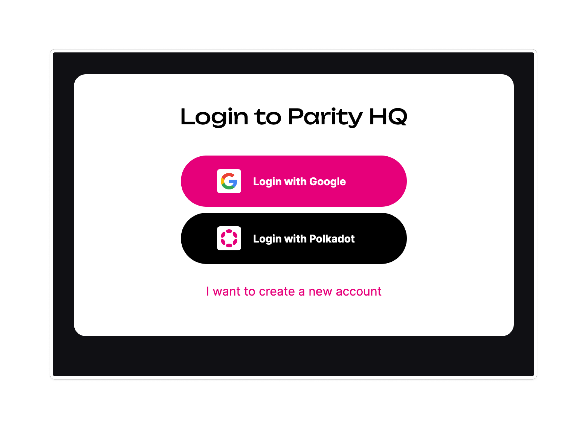

Two front doors: **Login with Google** (familiar Web2) or **Login with Polkadot** (self-sovereign Web3), plus "create a new account". This dual-door design is the bridge between mainstream users and crypto-native ones.

> **ELI5:** You can come in with your Google account like any normal website, or with your Polkadot identity if you want to be your own bank.

### 4.2 The home hub — an interactive office

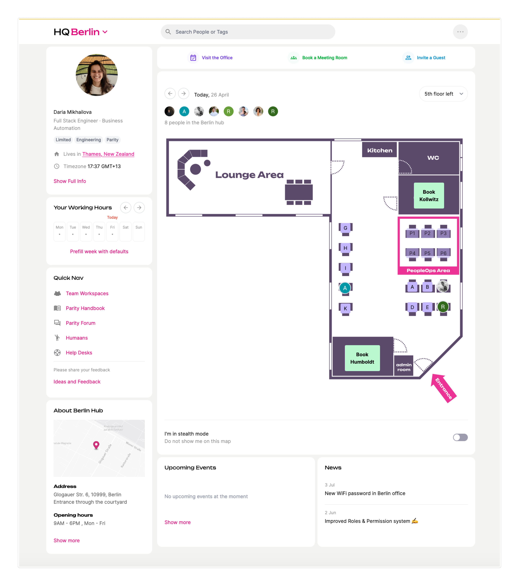

The "HQ Berlin" dashboard: your **profile card** (name, role, working hours), an **interactive floor map** (Lounge, Kitchen, meeting rooms, "PeopleOps Area"), **Quick Nav** (Team Workspaces, Handbook, Forum, Humaans, Help Desks), **Upcoming Events** and **News**. Note the **"I'm in stealth mode"** toggle — an early privacy control.

### 4.3 Global view — for the remote half of the team

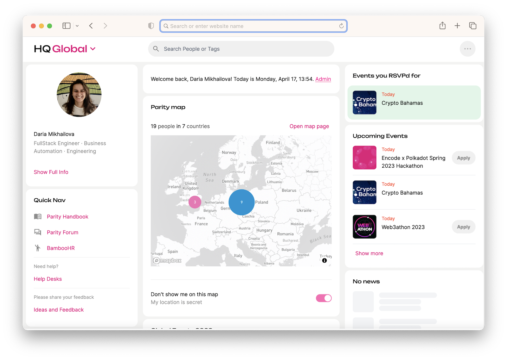

"HQ **Global**": a world map showing "**18 people in 7 countries**", event RSVPs, and upcoming events (e.g. *Crypto Bahamas*, *Encode × Polkadot Spring Hackathon*, *web3summit*). A **"Don't show me on this map"** toggle repeats the privacy-by-default theme.

### 4.4 The live floor map

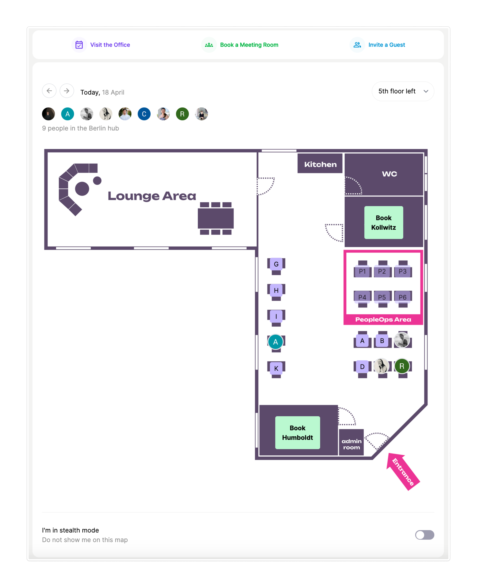

Real-time seating: who is in today (avatars), which zones are bookable, the **Entrance**, and again the **stealth-mode** switch ("Do not show me on this map").

### 4.5 Desk booking

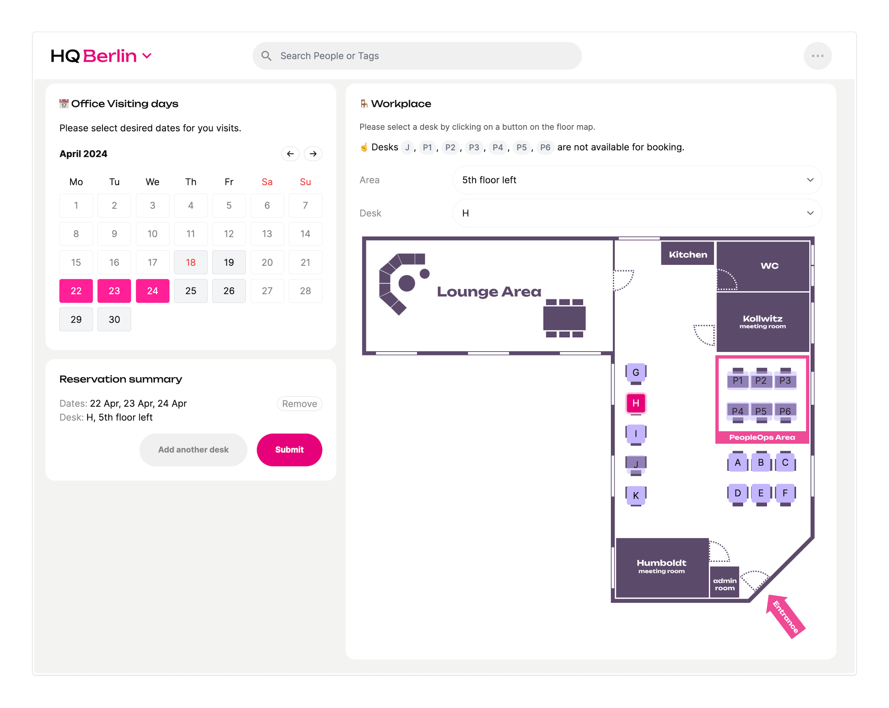

Pick visiting days on a calendar, then click a desk on the floor plan; a **reservation summary** lets you add desks and submit.

### 4.6 Meeting-room booking

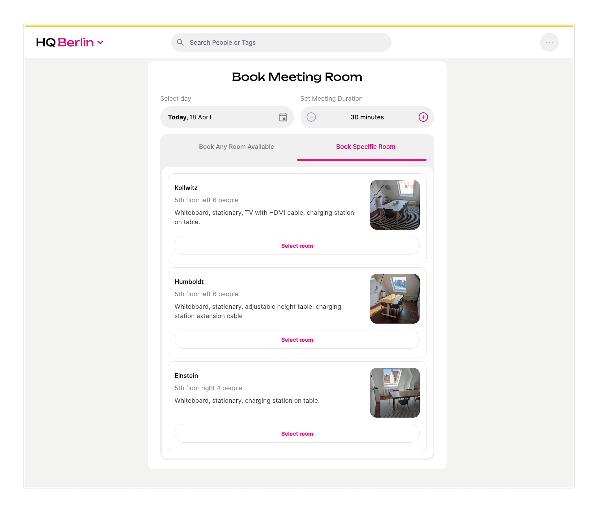

Choose a day and duration, then **"Book Any Room Available"** or **"Book Specific Room"** — rooms (Kollwitz, Humboldt, Einstein) list capacity and amenities (whiteboard, TV/HDMI, charging).

### 4.7 Events

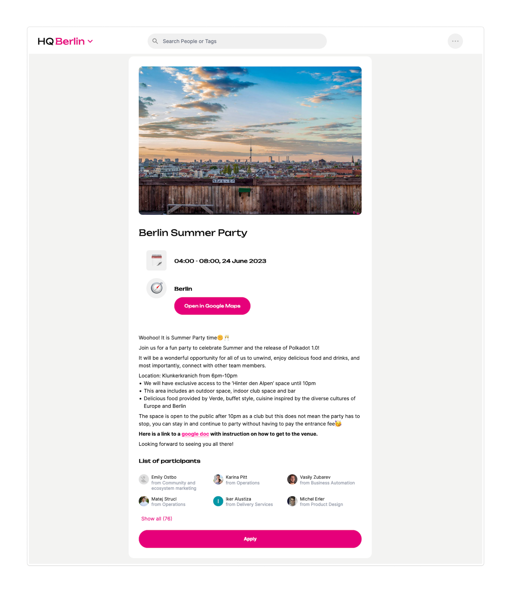

A full event page ("Berlin Summer Party"): date, map link, description, **list of participants**, and an **Apply** button.

### 4.8 Member profiles

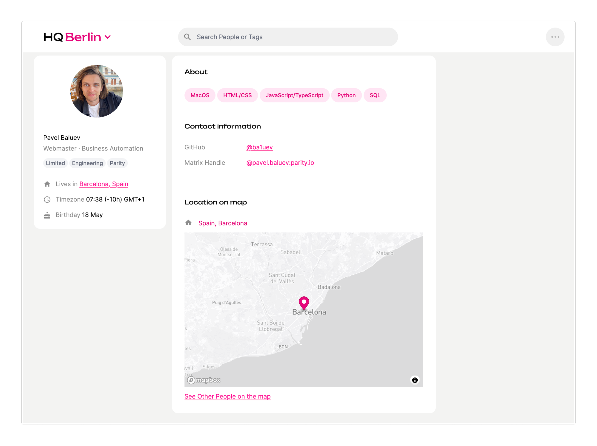

Rich profiles: skill tags (MacOS, HTML/CSS, JS/TS, Python, SQL), **contact** (GitHub, Matrix handle) and a **location-on-map** — useful for a distributed team.

### 4.9 About a location

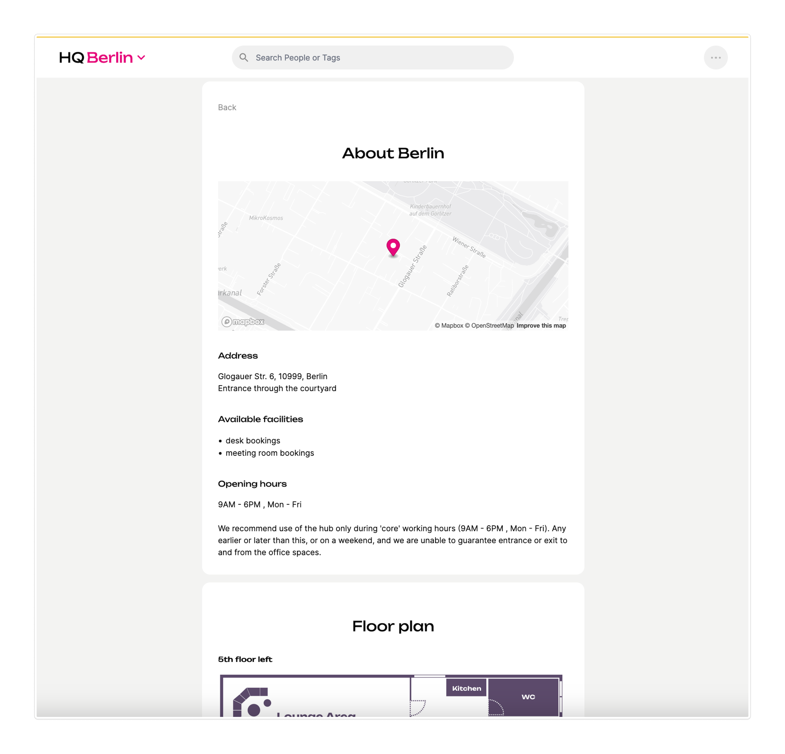

Static location page: address, available facilities (desk & meeting-room bookings), **opening hours**, and the floor plan.

### 4.10 Admin console — roles & governance

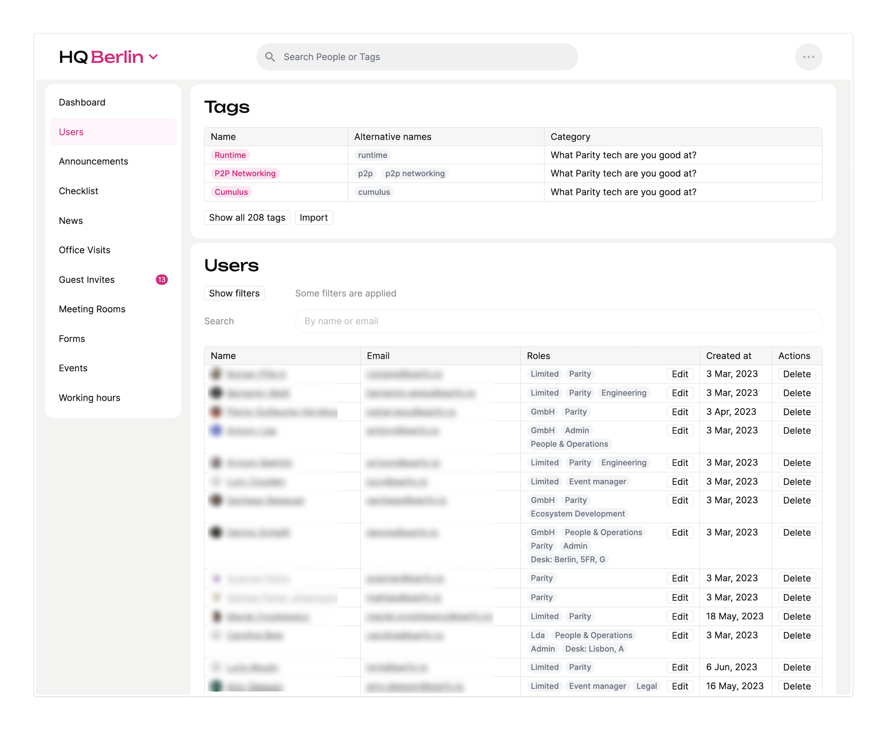

The back office: manage **Tags**, and a **Users** table with a flexible **role system** (Limited, Parity, Admin, Engineering, Event manager…), per-row **Edit/Delete**, plus modules in the sidebar (Announcements, Checklist, Office Visits, Guest Invites, Meeting Rooms, Forms, Events, Working hours).

### 4.11 Wallets — non-custodial by design

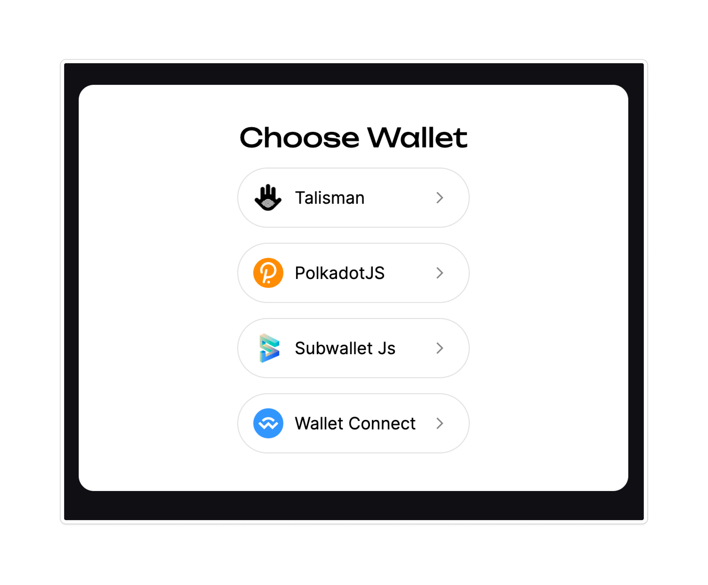

The crypto layer starts here: **Choose Wallet → Talisman, PolkadotJS, SubWallet, WalletConnect.** The app **never holds your keys**; it connects to a wallet you control.

> **ELI5:** The app doesn't keep your money. It just shakes hands with *your* wallet, which stays in your pocket.

### 4.12 Payment — pay by card, or by DOT at −20%

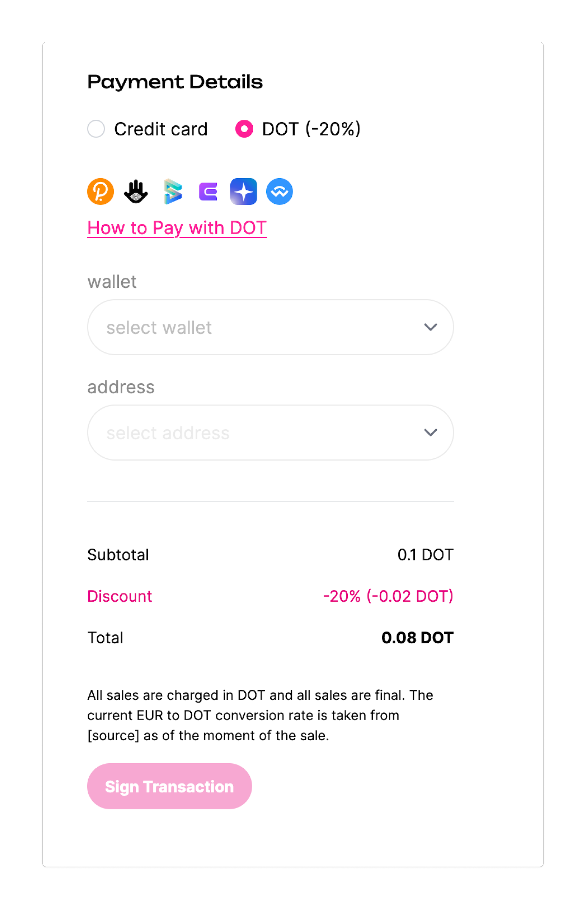

The cash register. You choose **Credit card** *or* **DOT (−20%)**. Paying in DOT gives an instant **20% discount** (here: subtotal `0.1 DOT`, discount `−0.02 DOT`, total `0.08 DOT`). A note states: *"All sales are charged in DOT and all sales are final. The current EUR to DOT conversion rate is taken from [source] as of the moment of the sale."* Then **Sign Transaction** (in your own wallet).

> **ELI5:** Pay with a card, or pay with DOT and get 20% off. The price in euros is turned into DOT at that second's exchange rate, and you approve the payment from your own wallet.

### 4.13 Collectibles — the membership & "credits"

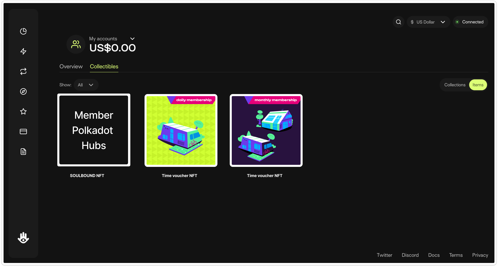

Your wallet's **Collectibles**: a **SOULBOUND NFT "Member Polkadot Hubs"** (your non-transferable membership badge) and **"Time voucher NFT"** items for **daily** and **monthly** membership. A currency selector ("US Dollar") and a "Connected" indicator complete the picture.

> **ELI5:** Your membership card is an NFT that can't be sold or given away (soulbound). Your "days in the space" are also NFTs — little time vouchers you spend to get in.

### 4.14 The end-to-end flow (the architecture in one picture)

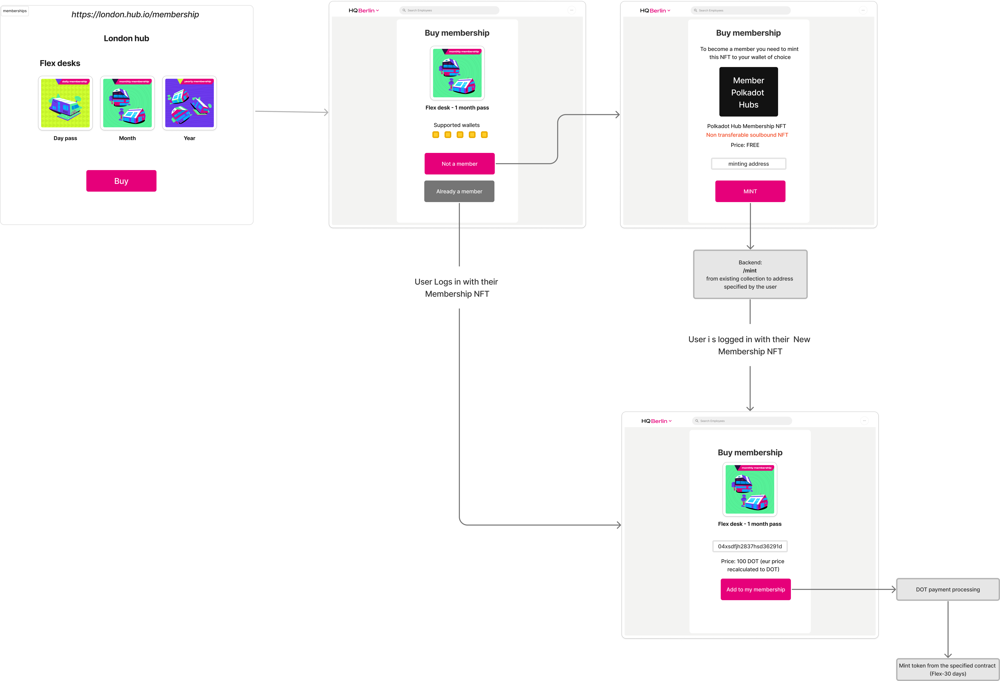

This diagram (URL `london.hub.io/membership` in the mock) is the whole money model:

1. **Pick a pass** — Flex desk: **Day pass / Month / Year** → *Buy*.
2. **Become a member (once):** if "Not a member", you **mint a free, non-transferable soulbound NFT** ("Member Polkadot Hubs") to the **wallet of your choice**. Backend: *mint from existing collection to the address specified by the user*.
3. **You're now logged in with your Membership NFT.**
4. **Buy the time:** "Flex desk — 1-month pass", **price `100 DOT` (your fiat price recalculated to DOT)** → **Add to my membership** → **DOT payment processing** → **mint the time token from the specified contract** (e.g. *Flex 30 days*).

> **ELI5:** First you get a free, un-sellable membership badge (an NFT). Then, whenever you want time in the space, you pay DOT and receive a "time voucher" NFT that unlocks those days.

---

## 5. The payment & credits system — answering the four questions

### 5.1 What "credits" does it use?

Three distinct instruments, do not conflate them:

| Instrument | Role | On-chain form |
|---|---|---|
| **DOT** | The **money** you pay with (and the basis of the −20% incentive) | Native Polkadot token |
| **Soulbound Membership NFT** ("Member Polkadot Hubs") | Your **identity / access pass** — proves you're a member | **Non-transferable** NFT, minted **free** from an existing collection |
| **Time-voucher NFT** (day / month / year) | The **spendable credit** that grants access time | NFT minted **from the specified contract** when you pay |

> **ELI5:** DOT = the cash. Membership NFT = your library card. Time-voucher NFT = the stamps you buy that say "you may use the space for X days."

### 5.2 How is privacy preserved?

Confirmed, evidence-based mechanisms (visible in the screenshots and flow):

1. **Non-custodial wallets** (`wallets.png`): the app connects to **Talisman / PolkadotJS / SubWallet / WalletConnect`; it **never holds your keys or funds**.
2. **Self-sovereign sign-in** (`login.png`): *Login with Polkadot* lets you authenticate with your own identity instead of an email/password the server stores.
3. **Soulbound, non-transferable identity** (`flow.png`, `nfts.png`): your membership can't be traded or impersonated, but it also isn't a re-sellable financial instrument.
4. **"Stealth mode"** (`app.png`, `map.png`, `screen-global.png`): toggles to **hide yourself from the office and global maps** — privacy *by default control*.
5. **Self-hosted** (README): each organization runs **its own instance** (React/Node/Postgres) — **data sovereignty**, no mandatory third-party SaaS holding member data.

> ⚠️ **Honesty:** this is **privacy by architecture (self-custody + self-hosting + opt-out visibility)**, **not** cryptographic anonymity (there are **no** zero-knowledge / mixer claims). On-chain, a DOT payment and an NFT mint are still publicly visible against the paying address.

> **ELI5:** Nobody is forced to trust a big company with their money or their location. You keep your own wallet, you can hide on the map, and your company runs the app on its own computers. But the blockchain payment itself is still public, like a receipt anyone can look up.

### 5.3 How is the **customer's** account funded / recharged?

From `payment.png` + `flow.png`:

1. **Connect your own wallet** (Choose Wallet).
2. **Mint the free soulbound membership** once (sets your identity).
3. **Pay in DOT**: the **fiat price (EUR/USD) is recalculated to DOT at the moment of sale**; you **Sign Transaction** in your wallet.
4. You **receive a Time-voucher NFT** (e.g. *Flex 30 days*) — that's your "topped-up" balance of access time.
5. *Alternative entry path:* the **gift-app voucher** mechanism (a secret/hash redeemed in one click) can onboard/fund someone who has no account yet.

> **ELI5 (customer):** Plug in your wallet, pay DOT, and a "time voucher" lands in your wallet. That voucher *is* your topped-up balance.

### 5.4 How is the **seller's** account funded / settled?

From `flow.png` ("Backend" + "DOT payment processing" + "Mint token from the specified contract"):

1. The **hub's smart contract / treasury** is the seller; it **receives the DOT** payment.
2. On payment, the backend **mints the time-voucher token from the specified contract** to the buyer.
3. The **soulbound membership** is minted **from an existing collection** controlled by the hub.
4. The hub keeps the DOT (its on-chain revenue); the membership/voucher contracts are the hub's "product catalog".

> **ELI5 (seller):** The space's smart contract is the till. It takes your DOT and, in return, stamps a time-voucher NFT into your wallet. The DOT it keeps is its income.

### 5.5 End-to-end, in one line

**Connect wallet → mint free soulbound membership → pay DOT (fiat→DOT at sale time, −20% vs card) → hub contract receives DOT and mints a time-voucher NFT → you hold the voucher = your access credit.**

---

## 6. The other payment track: consumer Polkadot App + Raise

Distinct from the Hub App, Parity's **consumer Polkadot App** (the design-system repos) uses an **external payments partner, Raise**, for **retail** spending. Per press materials:

- Pay at **1M+ US stores/sites** (expanding to 33 countries, 2,000+ brands) using **DOT** (and **USDT/USDC** stablecoins).
- **Up to 20% cashback in DOT**, funded by retailers.
- **Username instead of wallet address**; **payment links** via SMS/WhatsApp/email (the gift-app pattern) so recipients without the app can claim with one click.
- Micro-payments and P2P run on **Asset Hub**.
- **Raise** converts the crypto payment into **gift-card / merchant credit**, so the merchant settles in its familiar rails and (typically) never sees the buyer's wallet.

> ⚠️ Unlike the Hub App, the **consumer app's screenshots are not in the repos**, and operational specifics (merchant settlement currency, KYC, custody) are **not publicly documented**.

**Two payment models side by side:**

| | **Polkadot Hub App** (`polkadot-hub-app`) | **Consumer Polkadot App + Raise** |
|---|---|---|
| Use case | Membership / access to a coworking hub | Everyday retail shopping |
| Pay with | DOT (card optional) | DOT + USDT/USDC |
| "Credits" | Soulbound membership + time-voucher NFTs | Gift-card / merchant credit (via Raise) |
| Incentive | **−20%** for paying in DOT | **Up to 20% cashback** in DOT |
| Custody | **Non-custodial** (your wallet) | Username-based, partner-assisted |
| Screenshots in repo? | **Yes** (14 images) | No (design tokens only) |

---

## 7. Confirmed vs. not-yet-public (transparency note)

**✅ Confirmed (from repos, screenshots, blog, press):**
- The **Polkadot Hub App** exists, is self-hosted, and includes wallet connection, **DOT payments (−20%)**, **soulbound membership** and **time-voucher NFTs** (all shown in `docs/images`).
- The **membership flow** (free soulbound mint → DOT payment → voucher mint from a contract) is documented in the repo's own **flow diagram**.
- A **consumer Polkadot App** with **Raise** payments, **stablecoins**, **20% cashback**, **payment links** and **Asset Hub** micro-payments.
- A **privacy app registry** (`browse`) and **voucher onboarding** (`gift-app`, `claim-nft`).

**❓ Not documented publicly / to verify:**
- The **exact DOT conversion oracle** (the payment screen literally says "[source]").
- Whether/where DOT revenue is **held or off-ramped** by the hub operator.
- **KYC/AML** requirements for either app.
- **Custody of unclaimed gift/voucher funds** (on-chain escrow vs. custodial).
- For the consumer app: **merchant settlement currency & timing**, and whether the merchant ever sees the buyer's crypto identity.
- **No zero-knowledge / anonymity** mechanisms are claimed in either product.

> **Recommendation:** before making business decisions, read Parity's **Terms**, the **Raise API** docs, and (when published) the Hub App's contract addresses, so settlement, custody and KYC can be verified rather than assumed.

---

## 8. Sources

- [Parity Technologies · GitHub (org)](https://github.com/paritytech) · [Most-recently-updated repos](https://github.com/orgs/paritytech/repositories?type=source&sort=updated)
- [paritytech/polkadot-hub-app](https://github.com/paritytech/polkadot-hub-app) · screenshots: [`docs/images`](https://github.com/paritytech/polkadot-hub-app/tree/master/docs/images)
- [paritytech/polkadot-app-design-system](https://github.com/paritytech/polkadot-app-design-system) (+ `-android` / `-ios` / `-desktop`)
- [paritytech/browse](https://github.com/paritytech/browse) · [paritytech/gift-app](https://github.com/paritytech/gift-app) · [paritytech/claim-nft](https://github.com/paritytech/claim-nft)
- [paritytech/polkadot-sdk](https://github.com/paritytech/polkadot-sdk) · [Releases](https://github.com/paritytech/polkadot-sdk/releases)
- [Parity blog](https://www.parity.io/blog) — *"What is Polkadot Hub?"* (Feb 2026); *"Refining Polkadot's Economic Architecture: DOT Issuance, DAP…"* (Mar 2026)
- [Introducing the Polkadot Mobile App — Polkadot Ecosystem News](https://news.polkadotecosystem.com/news/introducing-the-polkadot-mobile-app-for-blockchain-mass-adoption)
- [Raise Announced as Payments Provider for the Polkadot Mobile App — PR Newswire](https://www.prnewswire.com/news-releases/raise-announced-as-payments-provider-for-the-polkadot-mobile-app-302200024.html)
- [Polkadot Visa Card proposal — polkadot.com](https://polkadot.com/newsroom/press-releases/polkadot-proposes-visa-card-for-worldwide-crypto-adoption/)

---

*Independent analysis from public sources (GitHub repos, screenshots inspected directly, Parity blog, press releases). Where official sources are silent, this is stated explicitly as "not documented publicly". Nothing herein is financial or investment advice.*
